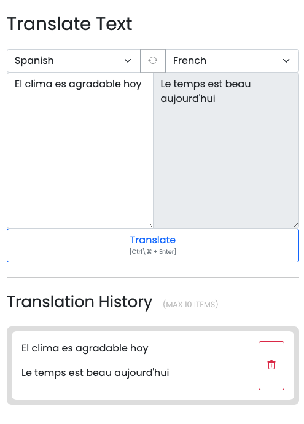
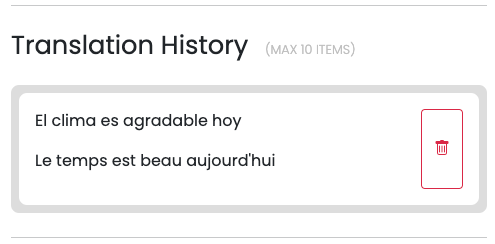
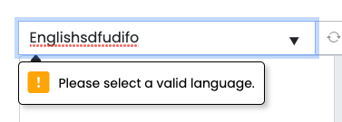
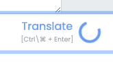
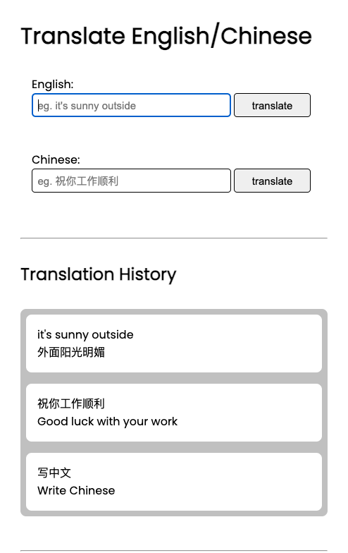
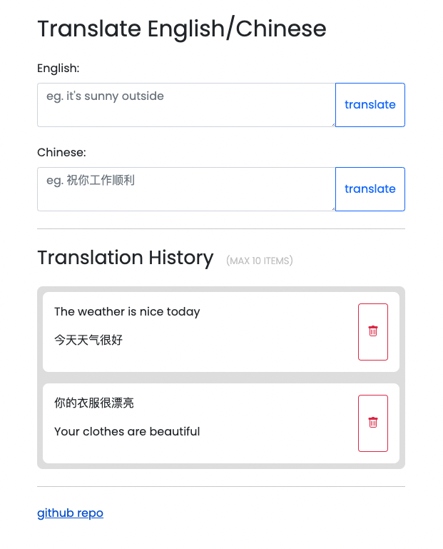
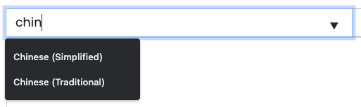
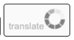
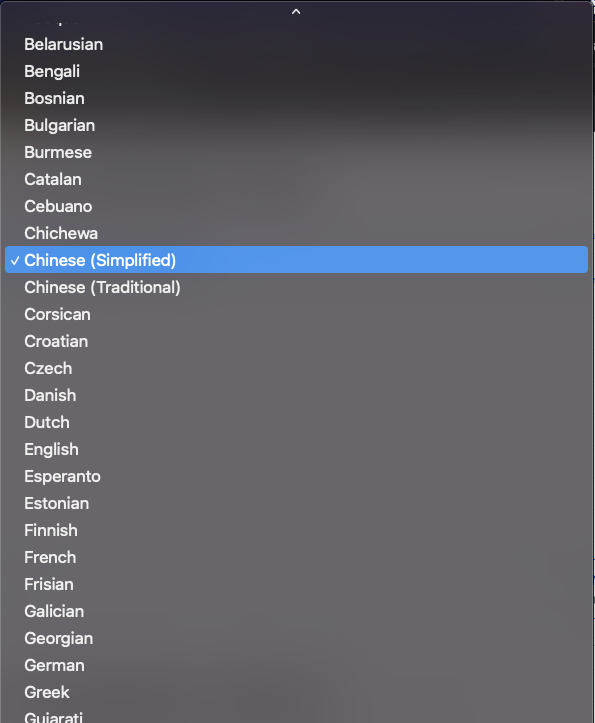

# [Deployed Site](https://translate-api.netlify.app/)



# Description

This api-implementation translates text between two languages of your choosing, and saves your translation history.
This project will help me practice my HTML, CSS, and Javascript, as I aspire to build out the core features of Google Translate.

## Technologies

Javascript, HTML/CSS, Bootstrap, SASS, APIs, Local Storage, Netlify

# Resources

- [NLP Translation API](https://rapidapi.com/gofitech/api/nlp-translation/)
  - I simply looked up translation apis and used the first one I found that worked. My goal was not to choose the best API but to get acquainted with using APIs. Anyhow, I dislike how this API takes several seconds to translate...there are definitely faster ones!
- Bootstrap (used to style forms and buttons)
  - some classes used:
    - used `input-group` on a container to make its children side by side (eg a text input next to a button)
    - used `form-control` on a text input to make it responsively span the page width
    - used `form-label` on a label for a text input

# Dependencies

- axios
  - used again inside the netlify function to access the translation API
  - (was also used in the frontend to access the netlify function, but via CDN)

# Lessons Learned

- Hide the api-key from the get go!
  - Here's a bad development practice: Hard-coding the api secret! It is risky to rely on memory to remove the api secret before committing and pushing up. At one point I forgot about the hard-coded secret...and I commited. Luckily, I remembered my mistake before I pushed up, so I used `git reset --soft HEAD~1` to undo the commit. Next time I'll just hide the api key from the get go.
- To access data from an axios response, one must access the data property!
  - This sounds rather obvious now, but the amount of times I tried to access data from the axios response without first accessing the data property, astonishes me.

# Feature: Translation History w/ Local Storage


After a translation is processed, it will automatically be stored in local storage and displayed on the page.

- CR~U~D
  - Create: Store the translated item in local storage.
  - Read: Display the items from local storage.
  - ~~Update~~: There is no need to edit the text of past translations.
  - Delete: Remove select translations from local storage.

# Coolest Achievement: Custom Toast



### Problem

The browser does a good job of alerting you when you fail to fill out a required field. However, how would I show popups for other errors, like an invalid language being typed in?

### Solution

I created a `insertToast` function that accepts 2 arguments: `text, refElement`. (Although Boostrap already has toasts, I was excited to make my own!)
I used this function to alert users when they submitted a form with invalid languages selected.

### Positioning

The toast will appear under `refElement`. This means that I can position this toast under any HTML element!

### Styling

I specifically styled the toast to look similar to the automatic popups that Chrome gives you when you do not fill in a required field.

### Required Parts:

- Javascript function
- SCSS styling
- Bootstrap Icons (imported via HTML link)

### function insertToast:

```
function insertToast(text, refElement) {
  //construct and insert toast:
  const toastStr = `
  <div class="my-toast">
    <i class="arrow-icon bi-caret-up-fill"></i>
    <div class="box">
      <i class="bang-icon bi-exclamation-square-fill"></i>
      <span class="text">${text}</span>
    </div>
  </div>`;
  document.body.insertAdjacentHTML("beforeend", toastStr);
  const toast = document.body.lastChild;

  //position based on refElement:
  const { x: refX, bottom: refBottom } = refElement.getBoundingClientRect();
  toast.style.left = refX + "px";
  toast.style.top = refBottom - 8 + "px"; //subtract 8 to adjust for the whitespace around arrow

  //vanish after 3 seconds:
  setTimeout(() => {
    toast.remove();
  }, 3000);
}
```

# User Experience



I love great user experience. In this case, I just added a simple loading wheel to inform users that their translation is processing. Otherwise, the user would get bored faster and leave!

# Potential Features:

- fix repo description
- be able to search for a language
- hide keyboard shortcut hint for mobile devices
- add feature for voice input!
- add copy/paste button
- add speaker buttons so that it reads aloud the clicked text!
- learn how to download JSON file of past translations!
- limit api requests per user
- notify users when the api is down (this api only allows about 300 free requests per month)
- create a slider to adjust the font size of chinese characters in the translation history?
- add bootstrap?
- move github repo link to the navbar?
- make sure site is responsive
- ~~allow translations between any two languages -- not just english and chinese!~~
- ~~change the input tag to a textarea tag so that more text can be shown!~~
- ~~learn how to customize url names for netlify, because 'https://cranky-wing-b0bad3.netlify.app/' sounds way too random!~~
- ~~allow users to see a history of their translations via localStorage~~
  - ~~allow users to delete items from translation history!~~
    - ~~beautify delete button layout with flexbox and a bootstrap icon~~
- ~~add keyboard shortcut (meta + enter) to submit translation form!~~

# Evolution

## Before and After Bootstrap





## Added Language Selection + Search



## Updated Loading Wheel




# Comparison of Language Selection Methods

I'm experimenting with different HTML structures to get the best language-selection method! Have a look!

## Language Selection Method 1: Select > Options



This is just a basic dropdown.

```
    <select name="selectSourceLang">
      <option value="">Select a Language</option>
      <option value="en">English</option>
      //etc
    </select>
```

### Pros

- Separation of Viewable Option Text and Select Value
  - Put another way, `selectEl.value` can be different from `optionEl.textContent` For example, this is possible: `selectEl.value === "en"` and `optionEl.textContent === "English`. This means that I can feed the lanugage code `en` directly into the translate api!

### Cons

- No search
  - Technically, you can still press a letter on your keyboard to see languages that start with that letter, but that hardly counts.
- No scroll bar
  - All the available languages span the entire height of the window! That's too much.

## Language Selection Method 2: Input w/ Datalist


This is essentially a regular input, with a list of suggested options.

```
 <input list="lang-list" name="selectSourceLang" placeholder="Select a Language">

  <datalist id="lang-list">
    <option value="English">English</option> //notice how the value is the exact same as the text content!
    //etc
  </datalist>

```

### Pros

- Search
- Scroll bar

### Cons

- Just One Input Value To Work With
  - For the options inside the datalist, the value should be exactly the SAME as the textContent. Otherwise, the dropdown will show two text items per option instead of one!
  - How I got the langauge code: I had to feed the full language word (eg: `inputEl.value === "English"`) into an object. (eg: `lang_langCode["English"] === "en"`)
- Not-Smart Search Ordering
  - If you search for "eng", "Bengali" will appear before "English". Ideally, I want the languages that start with the user-input to be shown first.
- Not-Smart Enter Press
  - If you type a partial language name and press enter, the language at the top of the list will NOT be selected. Instead, the form will submit, and the next required & unfilled form-control may be selected.
- Lacks No-Match-Message (Clicks do nothing)
  - If you type something that matches no languages, the list options disappear, but there is no message that says "no options". Thus, if a no-match word is entered, clicking the dropdown icon accomplish nothing.
- Backspace Bug
  - When you press backspace enough so that the field is empty, the entire list of languages do NOT show! The last time that the list updates is when you press backspace on the second to the last word.

## The Ideal Dropdown

[This website](https://table-42.herokuapp.com/) has an excellent dropdown menu (to select the number of people per table). It covers all of the cons that my current selection method has.

👋👋
