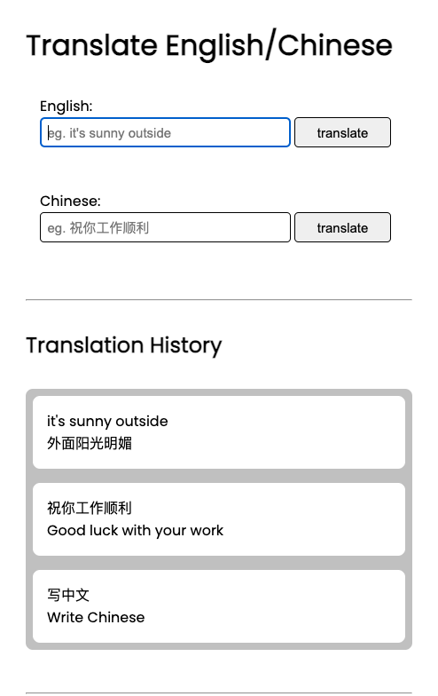
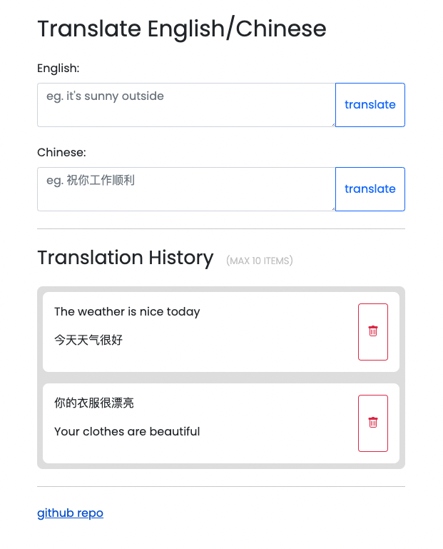
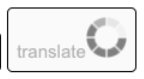

# [Deployed Site](https://translate-api.netlify.app/)

# Description

This api-implementation translates text between two languages of your choosing, and saves your translation history.

## Technologies

Javascript, HTML/CSS, Bootstrap, SASS, APIs, Local Storage, Netlify

# Resources

- [NLP Translation API](https://rapidapi.com/gofitech/api/nlp-translation/)
  - I simply looked up translation apis and used the first one I found that worked. My goal was not to choose the best API but to get acquainted with using APIs. Anyhow, I dislike how this API takes several seconds to translate...there are definitely faster ones!
- Bootstrap (used to style forms and buttons)
  - some classes used:
    - used `input-group` on a container to make its children side by side (eg a text input next to a button)
    - used `form-control` on a text input to make it responsively span the page width
    - used `form-label` on a label for a text input

# Dependencies

- axios
  - used again inside the netlify function to access the translation API
  - (was also used in the frontend to access the netlify function, but via CDN)

# Lessons Learned

- Hide the api-key from the get go!
  - Here's a bad development practice: Hard-coding the api secret! It is risky to rely on memory to remove the api secret before committing and pushing up. At one point I forgot about the hard-coded secret...and I commited. Luckily, I remembered my mistake before I pushed up, so I used `git reset --soft HEAD~1` to undo the commit. Next time I'll just hide the api key from the get go.
- To access data from an axios response, one must access the data property!
  - This sounds rather obvious now, but the amount of times I tried to access data from the axios response without first accessing the data property, astonishes me.

# Feature: Translation History w/ Local Storage

After a translation is processed, it will automatically be stored in local storage and displayed on the page.

- CR~U~D
  - Create: Store the translated item in local storage.
  - Read: Display the items from local storage.
  - ~~Update~~: There is no need to edit the text of past translations.
  - Delete: Remove select translations from local storage.

# A Note About User Experience

I'm a big advocate of great user experience. In this case, I just added a simple loading wheel to inform users that their translation is processing. Otherwise, the user would be discouraged by lack of a quick response, and leave.

# Potential Features:

- be able to search for a language
- hide keyboard shortcut hint for mobile devices
- add feature for voice input!
- add copy/paste button
- add speaker buttons so that it reads aloud the clicked text!
- learn how to download JSON file of past translations!
- limit api requests per user
- notify users when the api is down (this api only allows about 300 free requests per month)
- create a slider to adjust the font size of chinese characters in the translation history?
- add bootstrap?
- move github repo link to the navbar?
- make sure site is responsive
- ~~allow translations between any two languages -- not just english and chinese!~~
- ~~change the input tag to a textarea tag so that more text can be shown!~~
- ~~learn how to customize url names for netlify, because 'https://cranky-wing-b0bad3.netlify.app/' sounds way too random!~~
- ~~allow users to see a history of their translations via localStorage~~
  - ~~allow users to delete items from translation history!~~
    - ~~beautify delete button layout with flexbox and a bootstrap icon~~
- ~~add keyboard shortcut (meta + enter) to submit translation form!~~

# Evolution

## Plain HTML

## Added Bootstrap

## Added Language Selection

## Updated Loading Wheel

