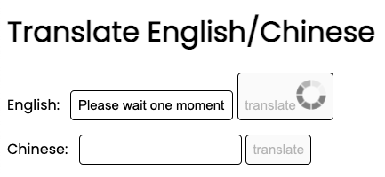

# [Click here for the deployed app!](https://cranky-wing-b0bad3.netlify.app/)
## Translate English text to Chinese text and vice versa!

# Resources

- (NLP Translation API)[https://rapidapi.com/gofitech/api/nlp-translation/]
  - I simply looked up translation apis and used the first one I found that worked. My goal was not to choose the best API but to get acquainted with using APIs. Anyhow, I don't like how this API takes several seconds to translate, there are definitely faster ones.

# Dependencies

- axios
  - used again inside the netlify function to access the translation API
  - (I also used axios in the frontend to access the netlify function, but in this case I used a CDN)

# Lessons learned:

- Hide the api-key from the get go!
  - I had a bad development practice: I would hard-code the api secret to test the api. Later, I would rely on memory to remove the api secret before commiting and pushing up. One time, I forgot to remove it, and I commited the api secret! Luckily, I was able to remove the commit via `git reset --soft HEAD~1` before I pushed up, saving me some trouble. Lesson learned!
- To access data from an axios response, I must access the data property!
  - This sounds rather obvious now that I've typed it out, but it still amazes me how often I've mistakenly tried to use the direct axios response, having forgotten the fact that the data....is actually in the data property!

# Cool little feature: Loading Wheel

I'm a big advocate of great user experience!  In this case, I just added a simple loading wheel to inform users that their translation is processing!  Otherwise, the user would be discouraged by lack of a quick response, and leave.

# Next steps?
- learn how to customize url names for netlify, because 'https://cranky-wing-b0bad3.netlify.app/' sounds way too random!
- limit api requests per user
- notify users when the api is down (this api only allows about 300 free requests per month)
